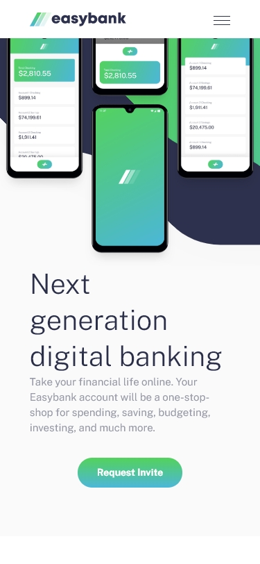
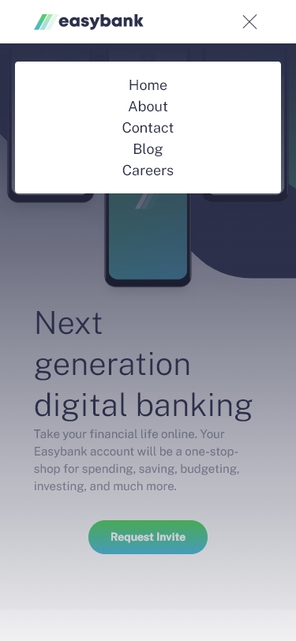
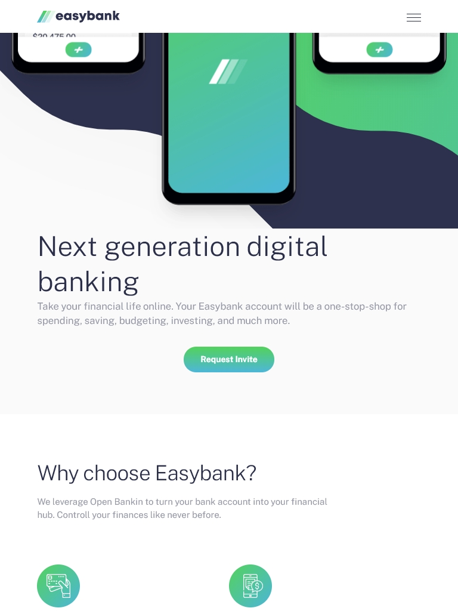
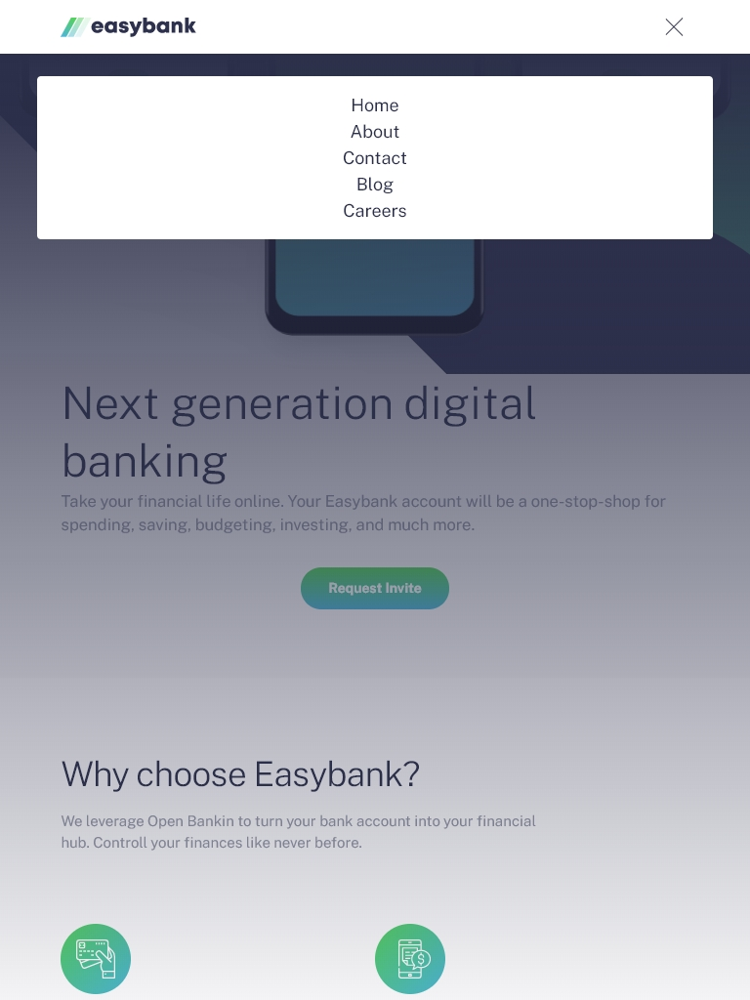
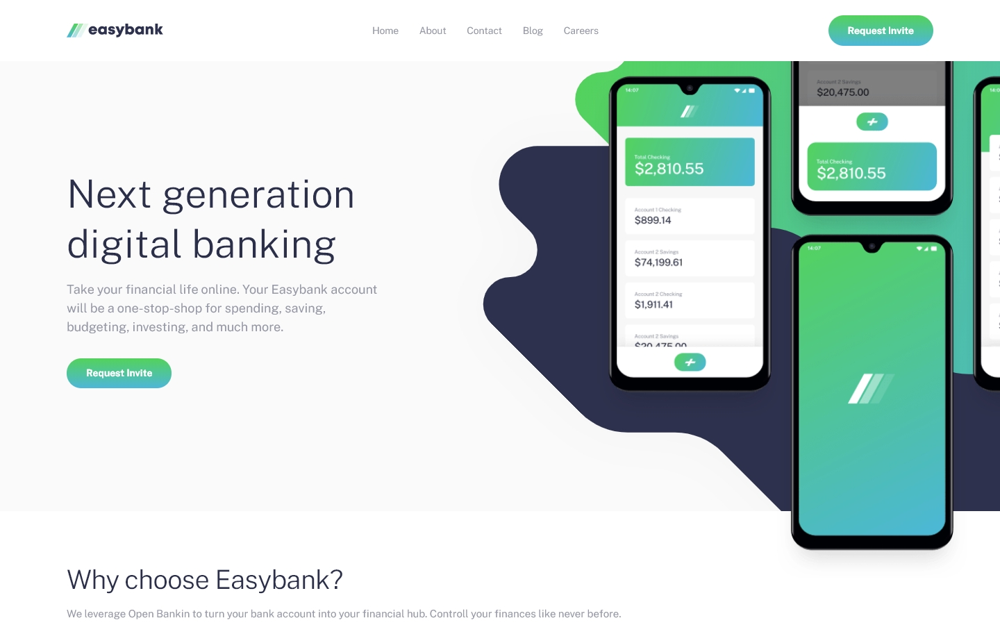

# My solution - Frontend Mentor -Easybank langing page.
[Easybank landing page challenge on Frontend Mentor](https://www.frontendmentor.io/challenges/easybank-landing-page-WaUhkoDN).

## Table of contents

- [Overview](#overview)
  - [The challenge](#the-challenge)
  - [Screenshot](#screenshot)
  - [Links](#links)
- [My process](#my-process)
  - [Built with](#built-with)
  

## Overview

### The challenge

Users shuld be able to:

- View the optimal layout for the site depending onther device's screen size
- See hover states for all interactive elements on the page

## Screenshot

### Smartphone (Iphone X)
IphoneX          |  IphoneX open Menu
:-------------------------:|:-------------------------:
  |  

### Tablet (Ipad)

Ipad           |    Ipad menu open
:-----------------------:|:------------------:
 | 

### Desktop (< 1440px)

 

### Links

- Solution URL: [Frontend Mentor Challenge](https://your-solution-url.com)
- Live Site URL: [Easybank landing page on vercel.](https://fem-easybank-landingpage.vercel.app/)

## My process

### Built with

- Semantic HTML5 markup
- CSS custom properties
- Flexbox
- Mobile-first workflow
